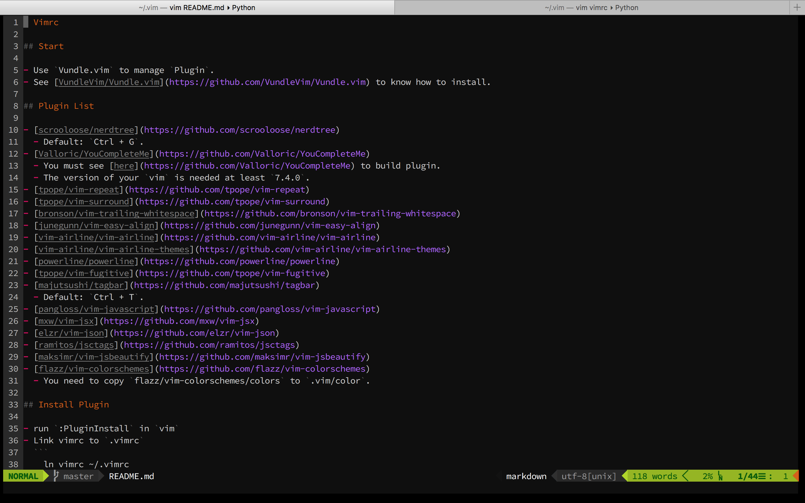

# Vimrc

## Start

- Use `Vundle.vim` to manage `Plugin`.
- See [VundleVim/Vundle.vim](https://github.com/VundleVim/Vundle.vim) to know how to install.

## Plugin List

- [scrooloose/nerdtree](https://github.com/scrooloose/nerdtree)
  - Default: `Ctrl + G`.
- [Valloric/YouCompleteMe](https://github.com/Valloric/YouCompleteMe)
  - You must see [here](https://github.com/Valloric/YouCompleteMe) to build plugin.
  - The version of your `vim` is needed at least `7.4.0`.
- [tpope/vim-repeat](https://github.com/tpope/vim-repeat)
- [tpope/vim-surround](https://github.com/tpope/vim-surround)
- [bronson/vim-trailing-whitespace](https://github.com/bronson/vim-trailing-whitespace)
- [junegunn/vim-easy-align](https://github.com/junegunn/vim-easy-align)
- [vim-airline/vim-airline](https://github.com/vim-airline/vim-airline)
- [vim-airline/vim-airline-themes](https://github.com/vim-airline/vim-airline-themes)
- [powerline/powerline](https://github.com/powerline/powerline)
- [tpope/vim-fugitive](https://github.com/tpope/vim-fugitive)
- [majutsushi/tagbar](https://github.com/majutsushi/tagbar)
  - Default: `Ctrl + T`.
- [pangloss/vim-javascript](https://github.com/pangloss/vim-javascript)
- [mxw/vim-jsx](https://github.com/mxw/vim-jsx)
- [elzr/vim-json](https://github.com/elzr/vim-json)
- [ramitos/jsctags](https://github.com/ramitos/jsctags)
- [maksimr/vim-jsbeautify](https://github.com/maksimr/vim-jsbeautify)
- [flazz/vim-colorschemes](https://github.com/flazz/vim-colorschemes)
  - You need to copy `flazz/vim-colorschemes/colors` to `.vim/color`.

## Install Plugin

- run `:PluginInstall` in `vim`
- Link vimrc to `.vimrc`
  ```
    ln vimrc ~/.vimrc
  ```
- Then, you can enjoy this.

## Screen Shot



